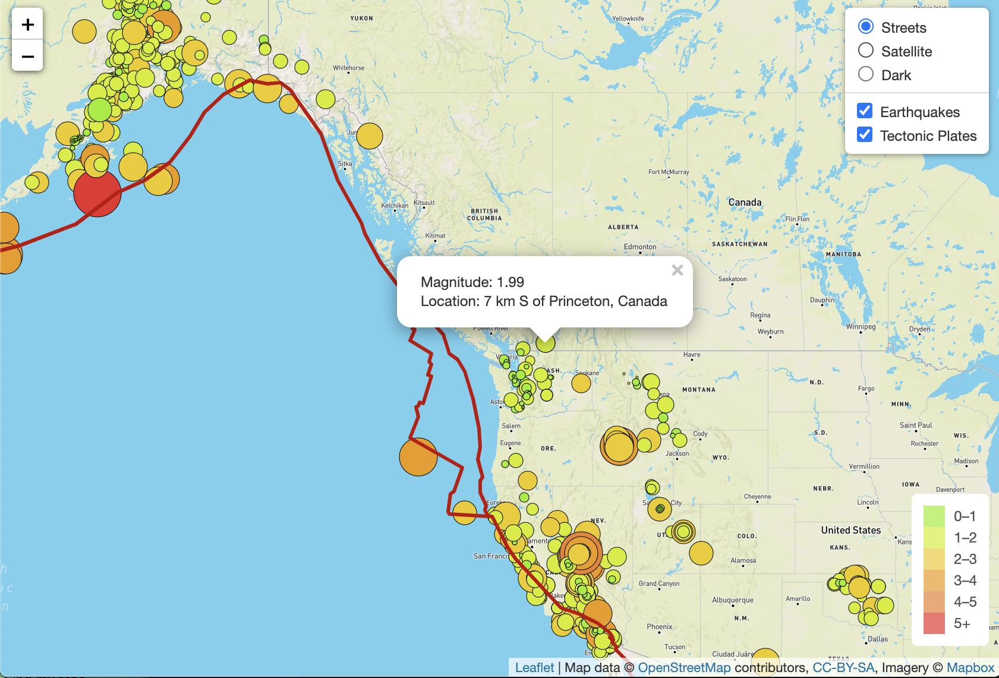

# Mapping Earthquakes

## Project Overview
Real-time (past 7 days) GeoJSON earthquake data was displayed in an interactive geographical map using the Leaflet's Application Programming Interface (API).

The location of each earthquake was visualized with a circle and a popup marker. The radius and colour of the circle marker corresponded to the earthquake's magnitude. The popup stated the earthquake's magnitude and location. Relationship of earthquake locations to tectonic plate boundaries was visualized. Three map viewing options ("Streets", "Satellite", and "Dark") were included.

Earthquake data was collected from the U.S. Geological Survey and tectonic plate boundaries were obtained from Hugo Ahlenius' "tectonicplates" GitHub repository.

#### Map Screenshot

## Resources
Software: JavaScript, Leaflet.js 1.6.0, D3.js, HTML5, and CSS3

Data: 
- U.S. Geological Survey's earthquake data: https://earthquake.usgs.gov/earthquakes/feed/v1.0/summary/all_week.geojson
- Hugo Ahlenius' tectonicplates Github repository: https://github.com/fraxen